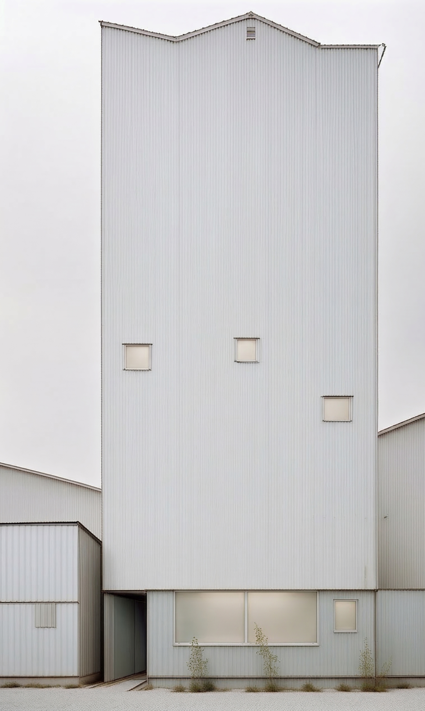
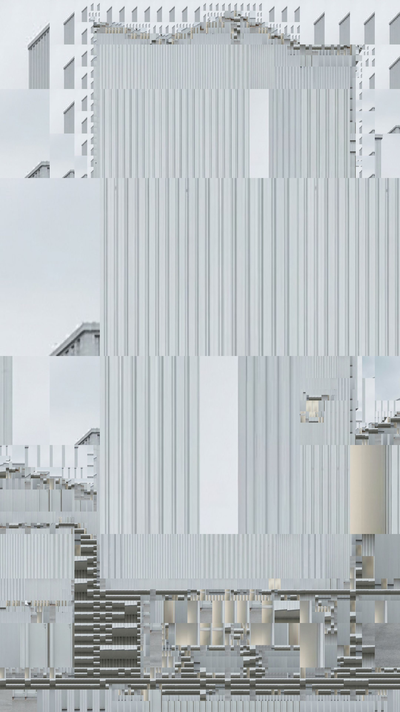

## DST (Agent-based Territorial Style Substitution)

This repository contains:

- `DST.py`: quadtree + agent-based tile substitution (file input or streaming camera mode)
- `DST_frame_nn.py`: whole-frame nearest-neighbor style substitution (no subdivision)
- `scripts/export_onnx.py`: export a `.keras` encoder to ONNX

- Subdivides an input image with a quadtree (splitting high-error regions)
- Encodes each tile with a neural encoder (from a `.keras` model)
- Substitutes each tile with its nearest-neighbor “style” patch from a style-image folder
- Optionally writes an MP4 animation of the substitution process

---

## Installation

### Requirements

- **Python**: 3.10+ recommended
- **OS**:
  - **Windows 10/11**: supported (CPU or NVIDIA GPU)
  - **Linux**: supported (CPU or NVIDIA GPU)
  - **macOS**: may work on CPU, but TensorFlow support can be limited depending on your Python/TF build

### Recommended hardware

- **Minimum (CPU)**: 4–8 cores, 16 GB RAM
- **Recommended (GPU)**: NVIDIA GPU with **8+ GB VRAM** (CUDA-capable), 32 GB RAM
  - TensorFlow GPU requires a compatible NVIDIA driver/CUDA stack for your TensorFlow build.

### Install steps

Create and activate a virtual environment, then install dependencies:

```bash
python -m venv .venv
```

Windows (PowerShell):

```bash
.\.venv\Scripts\Activate.ps1
pip install -r requirements.txt
```

Linux/macOS:

```bash
source .venv/bin/activate
pip install -r requirements.txt
```

---

## Model + data layout

You need:

- **Model**: a Keras `.keras` file (zip-format) passed via `--model-path`
- **Input image**: passed via `--input-path`
- **Style images folder**: passed via `--style-folder` (all images inside are candidates)

The repo currently includes example assets:

- Input image: `inputs/Gemini_Generated_Image_f9sfhjf9sfhjf9sf-edit.png`
- Example output image: `outputs/substitution.jpg`

---

## Quick start

From the repo root:

```bash
python DST.py ^
  --model-path ".\checkpoints\saved_model.keras" ^
  --style-folder ".\inputs\Gemini_Generated_Image_am1379am1379am13\quadtree" ^
  --input-path ".\inputs\Gemini_Generated_Image_f9sfhjf9sfhjf9sf-edit.png" ^
  --threshold 2 --min-cell 6 ^
  --use-random-split --w-randomness 0.5 --h-randomness 0.1 ^
  --agent-population 48 ^
  --verbose
```

Notes:

- Outputs are written to `./outputs/`.
- Disable video writing with `--no-save-substitution-video`.

### Streaming camera mode

Runs continuously: capture → subdivide → substitute → repeat. The preview is fullscreen/minimal if `--camera-display` is set.

```bash
python DST.py --use-camera --camera-display --encoder-backend keras --model-path ".\checkpoints\saved_model.keras"
```

### Whole-frame nearest neighbor (no subdivision)

This is the lightweight “match the whole frame to one style image” mode:

```bash
python DST_frame_nn.py --encoder-backend keras --model-path ".\checkpoints\saved_model.keras" --style-folder ".\inputs\Gemini_Generated_Image_am1379am1379am13\quadtree"
```

Press `ESC` to exit the fullscreen window.

---

## ONNX export + ONNX Runtime (optional)

### Export encoder to ONNX

```bash
python scripts/export_onnx.py --keras-path ".\checkpoints\saved_model.keras" --onnx-path ".\checkpoints\encoder.onnx"
```

### Run `DST.py` with ONNX Runtime

```bash
python DST.py --encoder-backend onnx --onnx-path ".\checkpoints\encoder.onnx" --ort-provider cpu
```

### Run `DST_frame_nn.py` with ONNX Runtime

```bash
python DST_frame_nn.py --encoder-backend onnx --onnx-path ".\checkpoints\encoder.onnx"
```

GPU acceleration for ONNX Runtime (CUDA/TensorRT) is environment-specific. If the GPU providers can’t load, the scripts will fall back to CPU.

---

## Notes / known issues

### Aspect ratio (camera preview)

- The fullscreen preview should be **aspect-fit** (letterboxed) and never stretched.
- If you see stretched output, confirm you are using the latest code where preview frames are rendered with an aspect-fit resize (not a direct resize to `--display-width` × `--display-height`).

### CUDA / TensorRT provider loading (Windows)

- Seeing errors like missing `cublasLt64_12.dll` / `cublas64_12.dll` means ONNX Runtime’s CUDA/TensorRT provider DLLs cannot load their CUDA dependencies and will fall back to CPU.
- Verify provider availability and loading with:

```bash
python -c "import onnxruntime as ort; print(ort.__version__); print(ort.get_available_providers())"
```

### Jetson Orin AGX optimization checklist

- Prefer **ONNX + TensorRT** for the encoder (and YOLO) on Jetson.
- Keep camera capture asynchronous (avoid blocking reads).
- Process at reduced resolution and **aspect-fit upscale** for display.
- Avoid per-frame disk writes (`camera_snapshot.png`, debug dumps) in streaming mode.
- Consider replacing `sklearn` nearest-neighbor with a faster 1-NN implementation (NumPy/Faiss) if NN time dominates.

---

## Inputs / CLI arguments

All “settings” at the top of `DST.py` are configurable via CLI flags (defaults match the file).

### Paths / I/O

- **`--model-path`**: Path to `.keras` model. Default: `../checkpoints/saved_model.keras`
- **`--encoder-backend`**: `keras` or `onnx`
- **`--onnx-path`**: Path to encoder `.onnx` (when `--encoder-backend onnx`)
- **`--ort-provider`**: `auto|tensorrt|cuda|cpu` (when `--encoder-backend onnx`)
- **`--style-folder`**: Folder of style images. Default: `inputs/.../quadtree` (see `DST.py`)
- **`--input-path`**: Input image path. Default: `inputs/...png` (see `DST.py`)
- **`--output-name`**: Output image filename (saved under input-derived folder). Default: `../outputs/substitution.jpg`

### Image + batching

- **`--img-width`**: Tile resize width for encoder. Default: 256
- **`--img-height`**: Tile resize height for encoder. Default: 256
- **`--style-batch-size`**: Batch size when encoding style images. Default: 64

### Quadtree subdivision

- **`--threshold`**: Subdivision error threshold. Default: 2
- **`--min-cell`**: Minimum leaf size in pixels. Default: 6
- **`--use-random-split`**: Enable randomized split positions (flag). Default: off
- **`--w-randomness`**: Width split randomness in \([0, 0.5]\). Default: 0.5
- **`--h-randomness`**: Height split randomness in \([0, 0.5]\). Default: 0.1

### Style-code options

- **`--use-global-avg-pool-for-codes` / `--no-use-global-avg-pool-for-codes`**: Default: on
- **`--use-memmap-for-style-codes` / `--no-use-memmap-for-style-codes`**: Default: off
- **`--style-codes-memmap-path`**: Default: `/tmp/style_codes.dat`

### Caching + nearest-neighbor config

- **`--style-cache-size`**: LRU cache size for loaded style images. Default: 128
- **`--patch-cache-size`**: LRU cache size for resized style patches. Default: 1024
- **`--nn-algorithm`**: scikit-learn NN algorithm. Default: `auto`
- **`--nn-metric`**: NN metric. Default: `euclidean`

### Style file-size filter

- **`--filter-small-style-files` / `--no-filter-small-style-files`**: Default: on
- **`--min-style-file-size-bytes`**: Default: 1200

### Video export

- **`--save-substitution-video` / `--no-save-substitution-video`**: Default: on
- **`--video-name`**: Default: `substitution_animation.mp4`
- **`--video-fps`**: Default: 24
- **`--video-codec-fourcc`**: Default: `mp4v`
- **`--video-queue-maxsize`**: Default: 128
- **`--save-every-n-substitutions`**: Default: 4
- **`--write-final-frame-at-end` / `--no-write-final-frame-at-end`**: Default: on

### Agent system

- **`--agent-population`**: Number of agents. Default: 24
- **`--agent-neighbor-k`**: Neighbor count for each tile in agent movement. Default: 24
- **`--agent-shuffle-each-round` / `--no-agent-shuffle-each-round`**: Default: off

### Reproducibility + logging

- **`--seed`**: RNG seed. Default: 42
- **`--verbose` / `--no-verbose`**: Default: off
- **`--style-log-every`**: Default: 20
- **`--subdivide-log-every`**: Default: 5000
- **`--agent-log-every`**: Default: 250
- **`--render-batch-detail` / `--no-render-batch-detail`**: Default: off

---

## Dependency versions

The pinned requirements depend on your platform (especially for TensorFlow). This repo provides version *ranges* in `requirements.txt` that are commonly compatible:

- `tensorflow>=2.16`
- `keras>=3.0`
- `numpy>=1.26,<3`
- `opencv-python>=4.8`
- `scikit-learn>=1.3`
- `onnxruntime>=1.17` (optional for ONNX backend)
- `onnx>=1.16` and `tf2onnx>=1.16` (optional for exporting ONNX)

If you need strict reproducibility, freeze your environment after install:

```bash
pip freeze > requirements-lock.txt
```

---

## Sample input / output

Sample input (from `inputs/`):



Sample output (written to `outputs/` in this repo snapshot):



